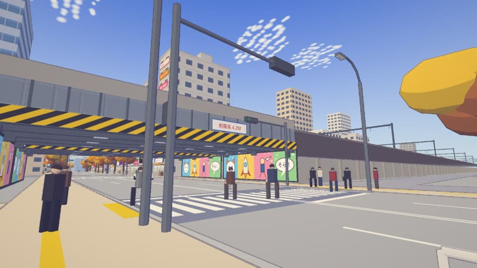
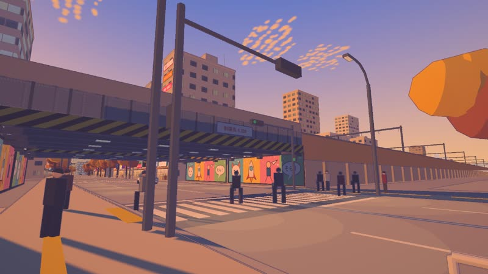
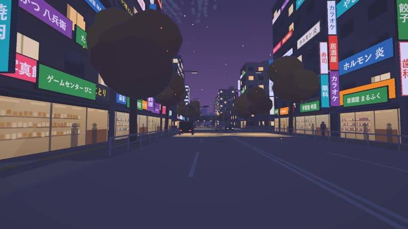
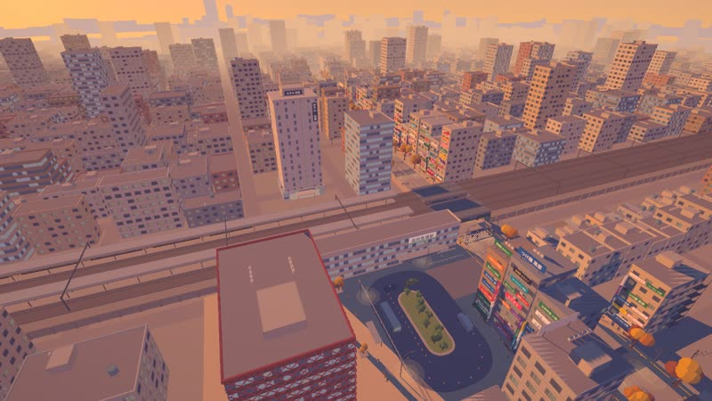

# 馬場の空 — 秋

秋の夕方、東京・高田馬場。**翼のある車**で早稲田通りを走り、ガードの手前から飛び立って街の上を飛ぶ。
降りて歩けば、駅前のロータリー、ガード下の横断歩道、赤ちょうちんの路地。新海誠風の光と空を目指した、
歩ける・走れる・飛べるアニメ背景風の 3D 世界です（Explore3D テンプレートから作成）。

| 昼 | 夕方 | 夜 |
|---|---|---|
|  |  |  |
|  |  |  |

```bash
npm install
npm run dev        # http://127.0.0.1:5180
npm run dev:vr     # HTTPS + LAN 公開（スタンドアロンのヘッドセットのブラウザから開くとき）
```

PC VR（Link / SteamVR）は、PC の Chrome か Edge で `npm run dev` の URL を開いて「ENTER VR」を押すだけで入れます
（localhost は HTTPS が要りません）。

## 巨大ロボットモード

スタート画面の「▶ 巨大ロボットで遊ぶ」（または URL に `?vehicle=robot`）で、翼のある車の代わりに全高 20 m のロボットに乗れます。

| ビームとバーニア、怪獣 | 崩れる雑居ビル |
|---|---|
|  |  |

- **ビーム**：左クリック（押しっぱなしで連射）。照準は画面中央。低いビルは 1 発、高いビルは 2〜3 発で崩れる。
  撃つと右腕（ビーム砲）が上がってターゲットへ向き、体もだんだん旋回する。腕が届かない間は腕の向いている先（近い位置）に当たり、
  向き切ると狙った所に当たる。**真後ろ（正面から 100° より後ろ）には撃てない**（先に旋回する）
- **バーニア**：Space・E で上昇、離すとゆっくり降下、Q で急降下。屋上にも降りられる
- **壊す**：ビーム、ダッシュ（Shift）や飛行中の体当たり、高いところからの着地、低いビルは歩いて踏み潰せる。崩れた跡には瓦礫の山と土煙
- **怪獣**：建物を **6 棟**壊すと、近くの地面から怪獣（架空の生き物、全高約 45 m）が現れる。建物を踏み潰しながら近づき、
  プラズマ弾を吐いてくる（当たると吹き飛ばされる）。**画面上部に体力ゲージ**（VR では怪獣の頭上にゲージ）
- **倒すと最初に戻る**：体力が 0 になると倒れて沈み、街がすべて元通りになり、ロボットはスタート地点へ

| キー | ロボット |
|---|---|
| W S / A D | 前後 / 旋回 |
| マウス | 照準（カメラは右肩越し） |
| 左クリック | ビーム |
| Shift | ダッシュ（空中では加速） |
| Space・E / Q | バーニア上昇 / 降下 |
| F | 乗り降り（地上で止まっているとき） |

**VR**：右トリガー ビーム（照準は顔の向き）、左スティック 前後、右スティック 旋回、A バーニア、左トリガー 降下、右グリップ ダッシュ、X 長押し 乗り降り。
人は出てこない無人の街という設定です（逃げまどう人は描かない）。

## 操作

| キー | |
|---|---|
| W A S D / 矢印 | 移動・運転（飛行中は W S が速度、A D が旋回） |
| Shift | 加速（地上で 58 km/h を超えると離陸できる） |
| **Space** | 離陸（地上で速度が出ているとき）／上昇 |
| E / Q | 上昇 / 下降 |
| 道路の上で高度を下げる | 着陸（道路以外には降りられない） |
| **C** | 遊覧飛行（自動で離陸して、駅・ガード・路地・ロータリーの上を周回）。もう一度押すと手動 |
| F | 乗る／降りる（地上で止まっているとき） |
| V | 一人称（コックピット）／三人称 |
| T | 朝→昼→夕方前→日没→夜 に時刻ジャンプ |
| P | 時刻の早送り |
| R | スタートに戻る |
| O / G | 墨線／グレードの切替 |

**VR**：右トリガー 加速、左トリガー ブレーキ、右スティック 旋回（地上で速度が出たら**上に倒して離陸**）、
左スティック 上下（飛行中は上昇・下降）、A 乗り降り、B 視点リセット、X タップ 早送り、**X 長押し 遊覧飛行**、
左グリップ＋左スティック上下 で時刻を回す。左手首の時計は飛行中に高度も出る。
酔い対策：頭は常に水平（機体のバンクは機体だけ）、コックピットの傾きは三人称の半分以下、速度・旋回・上下動で周辺が暗くなる。

URL で上書き：`?time=16.8&season=autumn&mobility=walk&vehicle=wingCar`

## この世界にあるもの

- **場所**：早稲田通り（4 車線・イチョウ並木）、JR と西武の 2 本のガード（黄黒の縞・制限高 4.2M・架空の壁画）、
  駅前広場とロータリー（コーン・バス・タクシー）、赤い格子のビル、看板だらけの雑居ビル、飲み屋の路地、
  電柱と電線、上を走る 2 本の電車、600 m 四方の街区、南の地平に副都心のシルエット。
- **テイスト**：いわし雲の群れ、夕方に桃色に染まる雲、太陽のグレア、金色の日向と青紫の日陰、細い紺色の線、
  夜は看板・窓・店内・ちょうちん・街灯の光だまりが灯る。
- **翼のある車**：レトロな軽自動車に高翼と後ろのプロペラ。翼は町中では畳んで立て、速度が上がると開く。
- 店名・看板・壁画・電車の塗装はすべて**架空**。駅名（地名）のみ実在。

## 仕組みと記録

- 構成・規約・既知の罠 → [CLAUDE.md](CLAUDE.md)
- この世界の約束・禁止事項・場所らしさトップ 10 → [docs/brief.md](docs/brief.md)
- 参考画像の読み取り → [docs/survey.md](docs/survey.md)
- 講評とディテールアップの記録 → `docs/critic-iter-1..5.md`、[docs/detail-top10.md](docs/detail-top10.md)
- 残課題 → [TASKS.md](TASKS.md)
- ロボットモードの仕組み → `src/game/`（destruction.ts 崩壊と復元、kaiju.ts 怪獣のモデル、game.ts ビーム・怪獣・リセット）
- 作り替え・作り込みの手順 → [PROMPT.md](PROMPT.md)、[DETAIL.md](DETAIL.md)

検証：`npm run explore`（走行・歩行・離陸・遊覧ループ・空中衝突・着陸、ロボットで 6 棟破壊→怪獣出現→撃破→街の復元、コンソールエラー）、
`npm run shoot -- --out=iter-N` → `node scripts/sheet.mjs --in=iter-N`（参考画像と 4 時刻を並べたシート）。

## 注意

- Google マップ／ストリートビューの画像は参考用です。`refs/` は `.gitignore` 済みなので公開リポジトリに含めないでください。
- VR の酔いや操作感は実機でしか確かめられません（未確認）。

## 参考にしたプロジェクト

- [Kenton-GMI/sakura-crossing](https://github.com/Kenton-GMI/sakura-crossing) — 墨線・影の色相シフト・検証の進め方
- [StarKnightt/summer-cycle](https://github.com/StarKnightt/summer-cycle) — 参考画像と Builder/Critic のループ

MIT License
