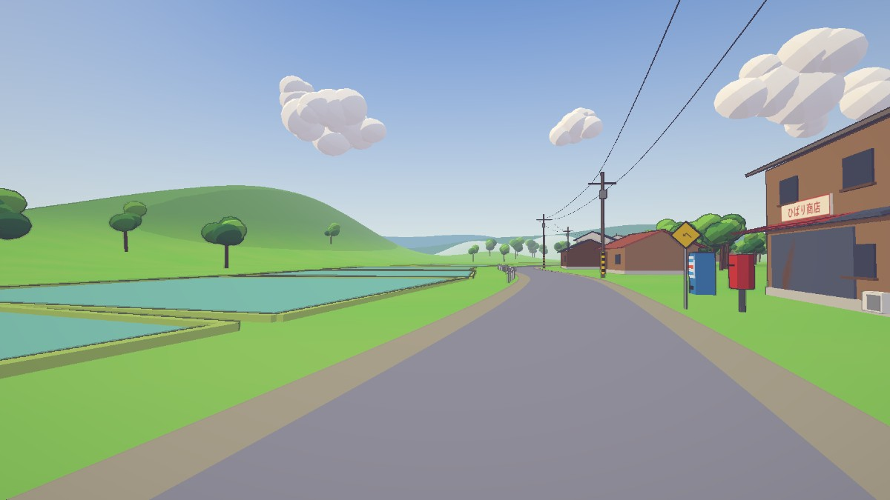
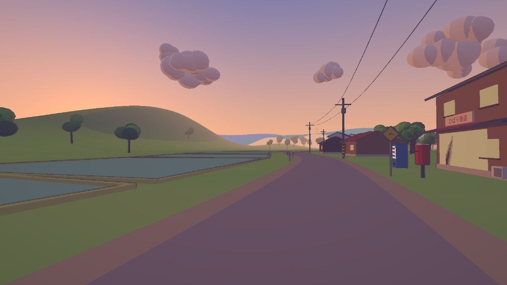
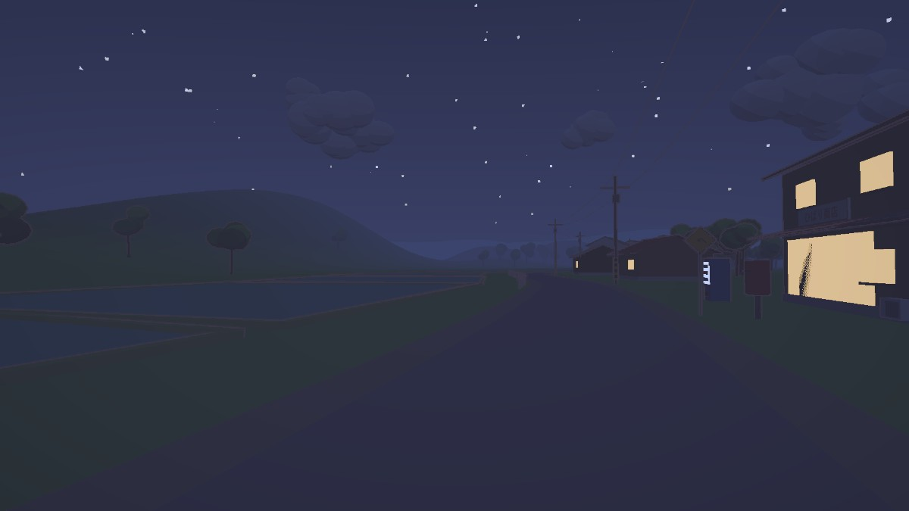

# Explore3D Template — アニメ背景風 3D 探検テンプレート

実在の場所（Google マップのスクショ）・乗り物・季節・テイストを伝えると、Claude Code が
このテンプレートを改変して **歩ける／乗れる「アニメ背景風」の 3D 世界** を作ってくれる、という土台です。

| 昼 | 夕方 | 夜 |
|---|---|---|
|  |  |  |

↑ テンプレートのままの状態（汎用の田舎道のデモ）。ここから自分の場所に作り替えます。

## 使い方

```bash
git clone <this repo> my-world
cd my-world
npm install
npx playwright install chromium   # 撮影・テスト用（初回のみ）
```

1. このフォルダで Claude Code を開き、**「PROMPT.md を読んで始めて」** と伝える。
2. Claude が質問してくるので答える：乗り物に乗るか／場所の画像（ストリートビュー 10 枚くらい）／
   テイストの画像／季節／地域／VR 機器／人を出すか／作り込みレベル（ラフ・標準・じっくり）。
3. 画像は `refs/place/`（場所）と `refs/style/`（テイスト）に `01.jpg, 02.jpg…` で置く（git には入らない）。
4. Claude が「この世界の約束・禁止事項・場所らしさトップ 10」を `docs/brief.md` にまとめるので確認する。
5. あとは Claude が「作る → 撮る → 参考画像と比べて直す」を繰り返して仕上げる。
   最初は配置と雰囲気だけを合わせ、そのあと作り込みに入る。

### ディテールアップ

一発で完成はしないので、出来上がった後も気になるところを指定して作り込めます（手順は [DETAIL.md](DETAIL.md)）。

- 部品で：「家をディテールアップして」「自転車を作り込んで」
- 地点で：「03 の地点を作り込んで」
- カテゴリで：「道路まわり」「植物」「夜の見え方」
- 強さ：「軽く」「とことん」

## すでに入っているもの

- **セル調の見た目**：量子化した光＋影を紫に色相シフト、深度の二階差分による墨線、主役の輪郭線、スプリットトーン
- **時刻インジケーター**：画面下のスライダーで 0〜24 時を連続変化。緯度と季節から太陽の位置を計算（夏は高く冬は低い）。
  夜は窓・自販機・ライトが点灯、星。▶ で 1 日を 60 秒で早送り
- **季節**：植生の色と粒子（春は花びら、夏は夜の蛍、秋は落ち葉、冬は雪）
- **移動**：徒歩／乗り物（ママチャリ・原付・軽トラ）／両方（F で乗り降り）
- **VR（WebXR）**：着座・一人称・水平固定・スナップターン・移動中の周辺減光・左手首の時計
- **検証**：`__shot()` でフレームを保存、`npm run shoot` で全地点×4 時刻を撮影、`npm run explore` で自動運転テスト

## 操作

| キー | |
|---|---|
| W A S D / 矢印 | 移動・運転 |
| マウス | 視点 |
| Shift | 走る・加速 |
| F | 乗る／降りる |
| V | 一人称／三人称（乗車時） |
| T | 朝→昼→夕方→日没→夜 に時刻ジャンプ |
| P | 時刻の早送り |
| R | スタートに戻る |
| O / G | 墨線／グレードの切替 |

**VR**：右トリガー 前進、左トリガー ブレーキ、右スティック 旋回、左スティック 歩く、A 乗り降り、B 視点リセット、
X 早送り、左グリップ＋左スティック上下 で時刻を回す。`npm run dev:vr` で HTTPS・LAN 公開し、ヘッドセットのブラウザから開く。

URL で上書き：`?time=18.5&season=autumn&mobility=walk&vehicle=keiTruck`

## 仕組み

構成・規約・既知の罠は [CLAUDE.md](CLAUDE.md)、作り替えの手順は [PROMPT.md](PROMPT.md)、作り込みの手順は [DETAIL.md](DETAIL.md)。

## 注意

- Google マップ／ストリートビューの画像は参考用です。`refs/` は `.gitignore` 済みなので公開リポジトリに含めないでください。
- 看板などの店名・ブランドは架空のものにしてください。
- VR の酔いや操作感は実機でしか確かめられません。

## 参考にしたプロジェクト

- [Kenton-GMI/sakura-crossing](https://github.com/Kenton-GMI/sakura-crossing) — 墨線・影の色相シフト・検証の進め方
- [StarKnightt/summer-cycle](https://github.com/StarKnightt/summer-cycle) — 参考画像と Builder/Critic のループ

MIT License
